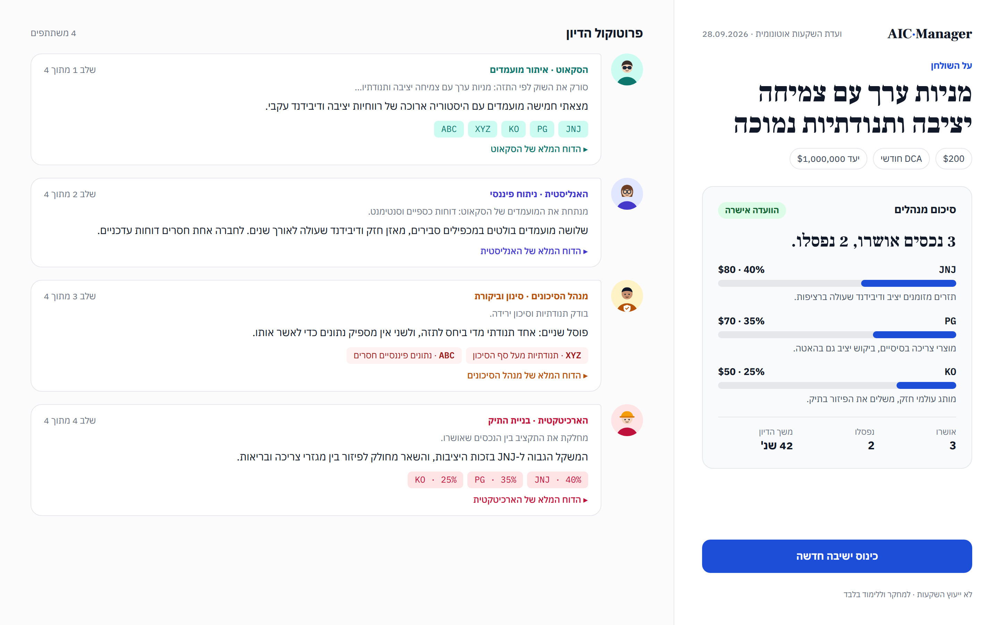
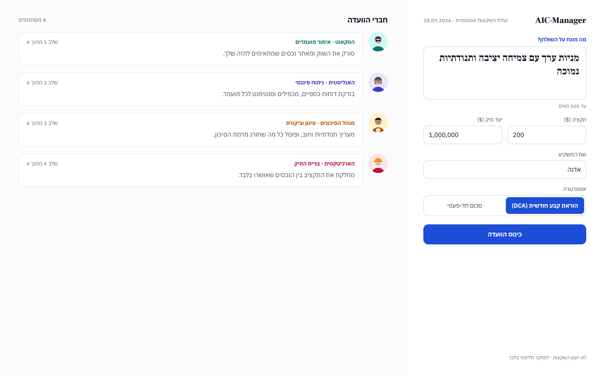

# AIC-Manager — Autonomous Investment Committee

Multi-agent investment research: **Scout → Analyst → Risk Manager → Architect**.  
Includes a **FastAPI** JSON API and a **Next.js** + Tailwind frontend (RTL / Hebrew-friendly).

**Disclaimer:** Not financial advice. For research and education only.

## Screenshots




## Repository layout

| Path | Role |
|------|------|
| `src/` | Python package: `config`, `agents`, `tools`, `research_flow`, `security` |
| `main.py` | FastAPI app (`GET /health`, `POST /api/research`) |
| `frontend/` | Next.js 16 (App Router) + React 19 + Tailwind |
| `scripts/` | Utilities (e.g. `list_models.py`) |
| `tests/` | Parser and API tests (`pytest`) |
| `docs/` | Screenshots |

## Security

- **Secrets:** Store API keys only in a root `.env` file. It is gitignored. Use `os.getenv` / `python-dotenv` in Python; `process.env` / `NEXT_PUBLIC_*` in Next.js where appropriate.
- **Never commit** `.env`, PEM files, or tokens. If a key was ever committed, rotate it and purge history (e.g. `git filter-repo` or GitHub secret scanning).
- **CORS:** Defaults to `http://localhost:3000`. Override with `CORS_ALLOW_ORIGINS` (comma-separated) in `.env`.
- **Inputs:** Thesis and investor name are sanitized server-side (`src/security.py`) and on the client (`frontend/src/lib/sanitize.ts`).
- **Markdown:** Agent reports use `rehype-sanitize` to reduce XSS risk from model-generated markdown. Secret-like tokens are redacted from every response. Links in reports open in a new tab without a referrer, and images in reports are never loaded.
- **Separation:** the Anthropic key lives only in the Python API (`.env`). The Next.js frontend never sees it; it only calls `/api/research`. The API listens on `localhost` by default.
- **Headers:** the frontend sends `X-Frame-Options: DENY`, `nosniff`, a strict referrer policy and no `X-Powered-By`.
- **Cost protection:** each research run makes several paid Anthropic calls, so a public deployment should set:
  - `AIC_ACCESS_KEY` — the UI then asks for an access code, sent as the `X-Access-Key` header;
  - `AIC_RATE_LIMIT_RUNS` / `AIC_RATE_LIMIT_WINDOW_SECONDS` — runs per IP per window (default 5 per hour);
  - `AIC_MAX_CONCURRENT_RUNS` — parallel runs (default 1);
  - `AIC_AGENT_MAX_ITER` — tool-call rounds per agent (default 12).

## Quick start

### 1. Python (API)

```bash
python -m venv venv
# Windows: venv\Scripts\activate
pip install -r requirements.txt
```

Copy `.env.example` to `.env` in the repo root and fill in at least:

- `ANTHROPIC_API_KEY` — required for the Claude agents
- Optional: `CLAUDE_MODEL` and the `AIC_*` cost-protection settings above

```bash
uvicorn main:app --reload --port 8000
```

### 2. Frontend

```bash
cd frontend
npm install
# optional: NEXT_PUBLIC_API_URL=http://localhost:8000
npm run dev
```

Open `http://localhost:3000`.

## Development

```bash
pip install -r requirements.txt -r requirements-dev.txt
ruff check . && pytest

cd frontend && npm run lint && npm run typecheck && npm run build
```

GitHub Actions runs both jobs on every push and pull request.

## Dependency audits

- **Python:** `pip install pip-audit && pip-audit` (or review `requirements.txt` pins in CI).
- **Node:** `cd frontend && npm audit` — address reported issues; avoid `npm audit fix --force` without review.

## License

MIT — see [LICENSE](LICENSE).
